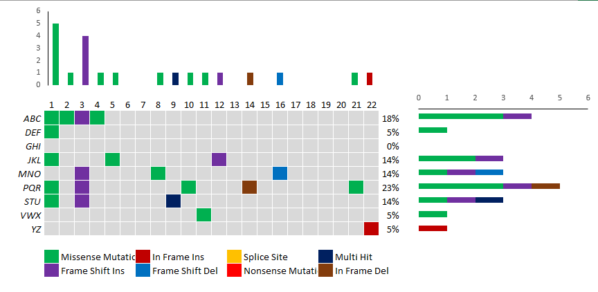

# excel-oncoplot

Simple Excel-based oncoplot to visualize gene mutations in a patient population.

[Direct Download](https://github.com/ptgrogan/excel-oncoplot/blob/master/oncoplot.xlsx?raw=true)

## Examples

## Overview

This repository contains a simple Excel spreadsheet for creating oncoplots to illustrate genetic mutations in a patient population. It does not require or depend on any other software to use. Edit the gray-shaded cells with a designated mutation type ID (below) to identify the observed mutation (rows) for each patient (columns).

The default configuration identifies eight types of mutations (by type ID):
 1. Missense Mutation (green)
 2. Frame Shift Insertion (purple)
 3. In Frame Insertion (dark red)
 4. Frame Shift Deletion (blue)
 5. Splice Site (orange)
 6. Nonsense Mutation (bright red)
 7. Multi Hit (dark blue)
 8. In Frame Deletion (brown)

and specifies nine placeholder genes (rows) for 22 patients (columns). Note that the 8 mutation types listed above are based on those in [maftools](https://github.com/PoisonAlien/maftools) but are only associated with unique identifiers in the spreadsheet and can be modified to suit different application cases. Additional mutation types can be added by modifying the "Conditional Formatting" rules that color the gray cells based on a unique identifier.

A bar plot above indicates mutation type per patient and a bar plot to the right indicates mutation type per gene. 

Add or remove genes by right-clicking on a row and selecting "Insert" or "Delete". After inserting a new row, copy and paste the equations for the entire row from an adjacent row.

Add or remove patients by right-clicking on a column and selecting "Insert" or "Delete". After inserting a new column, copy and paste the equations for the entire column from an adjacent column.

## Contact

Paul T. Grogan <pgrogan@stevens.edu>
